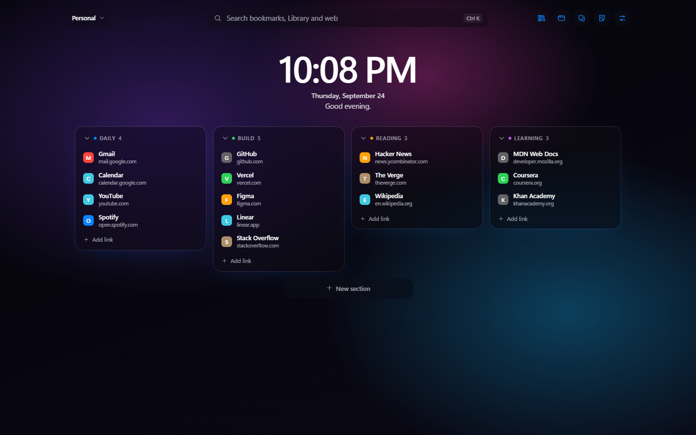
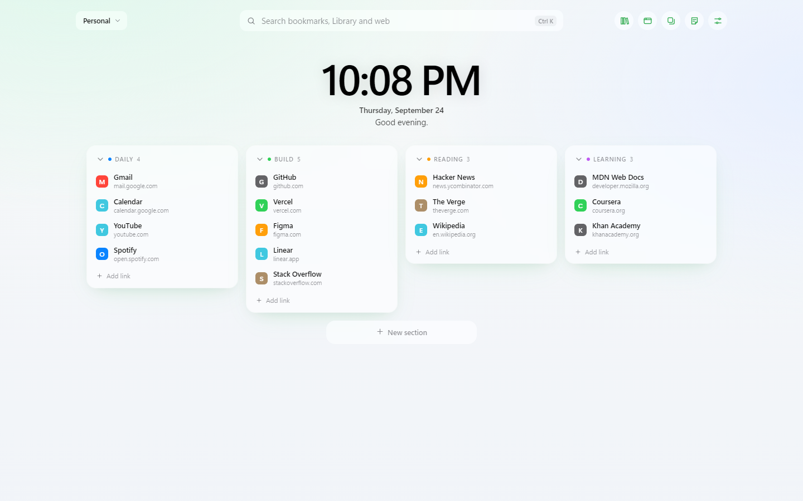
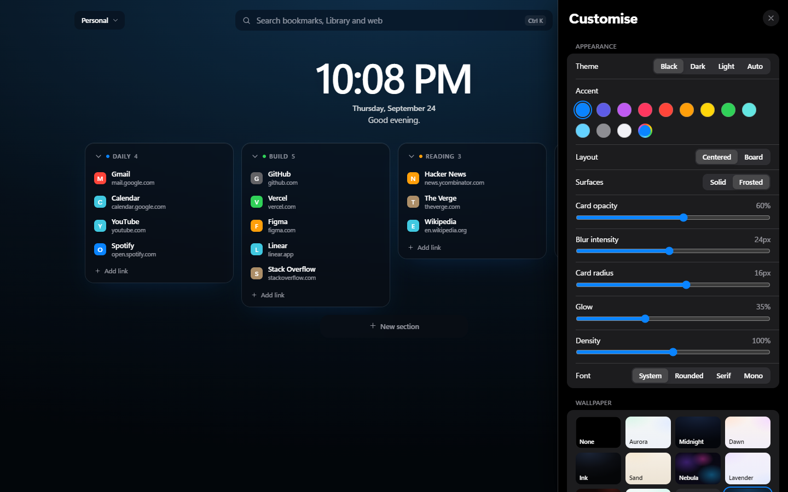

# TabOgt

A calm, fast bookmark dashboard for every new tab in **Brave**, **Chrome** and other Chromium browsers.
Workspaces, sections, a searchable Library for all your imported bookmarks, drag and drop everywhere,
frosted wallpapers, and free sync between laptops through your own private GitHub repository.

No accounts, no tracking, no build step: plain JavaScript that runs straight from this folder.



| Light theme | Customise |
|---|---|
|  |  |

---

## Contents

- [Features](#features)
- [Install](#install)
- [Update](#update)
- [Set up on another laptop and sync](#set-up-on-another-laptop-and-sync)
- [Import your bookmarks](#import-your-bookmarks)
- [Keyboard shortcuts](#keyboard-shortcuts)
- [Development](#development)
- [Troubleshooting](#troubleshooting)
- [Privacy](#privacy)
- [License](#license)

---

## Features

- **Two layouts:** *Centered*, a clock with frosted list cards (the default), or *Board*, a wide grid of icon tiles.
- **Workspaces and sections:** drag to reorder links, sections and workspaces; right-click anything for more options.
- **Library:** imports go into one searchable list instead of cluttering the page. **Organize** sorts it into a workspace by topic (Dev, Design, Video, News and more).
- **Search (Ctrl K):** covers bookmarks, the Library, commands (type `>`) and the web. Drag any result onto the board.
- **Import:** Brave/Chrome bookmarks, browser HTML exports, Raindrop, Pocket, any CSV with a link column, or a plain `.txt` list of links.
- **Themes:** Black (OLED), Dark and Light, with iOS system accent colours. Text on buttons stays readable with any accent.
- **Wallpapers:** 13 gradients, or your own photo (upload or paste a link), with frosted cards you can tune: opacity, blur, radius, spacing, density and glow.
- **Sessions:** save every tab in a window and bring them back later.
- **Notes:** each workspace has its own notes, saved automatically.
- **Toolbar popup:** save the page you're on (Alt+Shift+D), or save instantly to your last section (Alt+Shift+S).
- **Sync:** optional, free, through a private GitHub repository you own. Edits made on two laptops are merged, not overwritten.

## Install

You need **Brave, Chrome or Edge, version 111 or newer**. Nothing else is required to *use* TabOgt;
Node.js is only needed if you want to run the tests (see [Development](#development)).

### 1. Get the code

**With Git:**

```bash
git clone https://github.com/xdrk14/TabOGT.git
```

**Without Git:** on the GitHub page click **Code > Download ZIP**, then unzip it.

Put the folder somewhere permanent (for example `Documents\TabOgt`).
The browser loads TabOgt from this folder, so don't delete or move it later.

### 2. Load it into the browser

1. Open the extensions page:
   - Brave: `brave://extensions`
   - Chrome: `chrome://extensions`
   - Edge: `edge://extensions`
2. Turn on **Developer mode** (a switch in the top-right corner, or the left sidebar in Edge).
3. Click **Load unpacked** and select the `TabOgt` folder (the one that contains `manifest.json`).
4. Open a new tab. If the browser asks whether to keep the new-tab change, choose **Keep it**.
5. Click the puzzle icon in the toolbar and **pin TabOgt** so the save popup is one click away.

That's it. You can ignore the `tests` folder; the extension doesn't use it.

## Update

**With Git:**

```bash
cd TabOgt
git pull
```

**With a ZIP:** download the new ZIP and replace the files in the same folder.

Then open `brave://extensions` and click the **reload** arrow on the TabOgt card.

> Always update the files **in the same folder**. Loading TabOgt from a different folder makes the browser treat it
> as a new extension with empty data. If that happens, use the steps in [Troubleshooting](#troubleshooting).

## Set up on another laptop and sync

Install TabOgt on each laptop as above, then connect both to the same **private** GitHub repository.
This is free and takes about 3 minutes the first time.

**1. Create a private repository for your data** (separate from this code repository):

1. Go to [github.com/new](https://github.com/new).
2. Name it, for example `tabogt-data`.
3. Choose **Private**.
4. Click **Create repository**.

**2. Create an access token:**

1. On GitHub, go to **Settings > Developer settings > Personal access tokens > Fine-grained tokens > Generate new token**.
2. **Repository access:** *Only select repositories* > `tabogt-data`.
3. **Permissions > Repository permissions > Contents:** *Read and write*.
4. Click **Generate** and copy the token. It starts with `github_pat_`.

**3. Connect TabOgt:**

1. Open a new tab and go to **Customise (sliders icon) > Sync**.
2. Enter `yourname/tabogt-data` and paste the token.
3. Click **Connect**.

**4. On the next laptop:** do step 3 again and choose **Use GitHub data**.

**How it works after that:**

- Changes upload a few seconds after you make them.
- Other laptops pick them up when you open a new tab, and every 5 minutes.
- If you edit on two laptops before they sync, both sets of changes are kept.
- The token is stored only in that browser. It is not in backups or in the synced file.
- When the token expires, make a new one and click **Connect** again.

## Import your bookmarks

Open the **Library** (first toolbar icon), then choose one of:

- **Import from Brave:** copies your browser bookmarks, keeping their folders.
- **Import file:** accepts
  - browser bookmark exports (`.html`)
  - Raindrop exports (HTML or CSV)
  - Pocket and any other CSV or TSV with a link column
  - a `.txt` list of links
  - a TabOgt backup (`.json`)

Imports land in the Library as one list (duplicates are skipped) and are searchable with **Ctrl K**.
To put them on the board:

- click **Organize into a workspace** to have them sorted by topic, or
- drag a Library folder or a search result onto the board, or
- press **+** / **Alt+Enter** on a search result.

## Keyboard shortcuts

| Keys | Action |
|---|---|
| **Ctrl K** or **/** | Search and commands (type `>` for commands) |
| Just start typing | Search |
| **Alt Enter** | Add a Library search result to the board |
| **Ctrl V** | Paste a link into the section under the mouse |
| **Alt 1** to **Alt 9** | Switch workspace |
| **Ctrl Z** | Undo the last change |
| **E** or **F2** | Edit the focused bookmark |
| **Delete** | Delete the focused bookmark |
| **Esc** | Close panels, menus and dialogs |
| **Alt Shift D** | Open the save popup (on any page) |
| **Alt Shift S** | Save the current page instantly (on any page) |

Change the Alt+Shift shortcuts at `brave://extensions/shortcuts`.

---

## Development

TabOgt is a Manifest V3 extension written in plain ES-module JavaScript: no framework, no bundler, no build step.
Edit a file, click **reload** on the extension card, and open a new tab.

### Project layout

| Path | What it is |
|---|---|
| `manifest.json` | Extension manifest: permissions, new-tab override, popup, shortcuts |
| `newtab.html` / `newtab.css` / `newtab.js` | The dashboard |
| `popup.html` / `popup.css` / `popup.js` | The toolbar "Save to TabOgt" popup |
| `background.js` | Service worker: right-click menus, Alt+Shift+S quick-save, sync scheduling |
| `store.js` | Shared data layer (`chrome.storage.local`), data validation and migrations, colour contrast helpers |
| `sync.js` | GitHub sync: three-way merge plus the GitHub Contents API |
| `organize.js` | Sorts Library bookmarks into topic sections |
| `boot.js` | Applies the saved theme before the page paints (no flash) |
| `icons/` | Extension icons; `icon.svg` and `icon-small.svg` are the sources |
| `tests/` | Playwright end-to-end tests and tooling (not part of the extension) |
| `docs/` | README screenshots |
| `CHANGELOG.md` | What changed in each version, and why |

### Requirements

- **Node.js 18 or newer:** download from [nodejs.org](https://nodejs.org), then check with `node -v`.
- **A Chromium browser:** the tests use your installed **Brave** by default.

### Install the test tools

```bash
cd tests
npm install
```

The tests use your installed Brave (`%LOCALAPPDATA%\BraveSoftware\Brave-Browser\Application\brave.exe`).
If you don't have Brave, either point them at another Chromium browser (see below), or download
Playwright's own Chromium:

```bash
npx playwright install chromium
```

### Run the tests

Run everything (about 2 minutes). It opens a throwaway browser profile, never your real one:

```bash
npm test
```

Run only the tests whose name matches some text:

```bash
npm run test:one -- "search"
```

Options, set as environment variables before `npm test`:

| Variable | Effect |
|---|---|
| `HEADED=1` | Show the browser window while testing |
| `GPU=1` | Use the graphics card (closer to real performance numbers) |
| `TABOGT_BROWSER=<path>` | Use a different browser executable (Chrome, Edge, Chromium) |

Setting a variable, for example `HEADED`:

- **PowerShell:** `$env:HEADED=1; npm test`
- **Command Prompt:** `set HEADED=1 && npm test`
- **macOS/Linux:** `HEADED=1 npm test`

Screenshots and a performance report (`perf.json`) are written to `tests/screenshots/`.

### Other scripts

Re-render the README screenshots in `docs/`:

```bash
npm run docs
```

Rebuild `icons/*.png` from `icons/icon.svg` and `icons/icon-small.svg`:

```bash
npm run icons
```

---

## Troubleshooting

**Every new tab looks empty after an update.**
The browser identifies an unpacked extension by its folder. If TabOgt was loaded from a new folder,
it starts with empty data. To get your bookmarks back:

1. In the old copy (or any laptop where your data is), use **Customise > Back up (JSON)**.
2. In the new copy, use **Customise > Import file**.

With sync connected, just connect again and choose **Use GitHub data**.

**"Could not load manifest" or files are missing (OneDrive or Google Drive folder).**
Make sure the folder is available offline: right-click it and choose **Always keep on this device** or **Available offline**.

**The new tab still shows the browser's own page.**
Check that TabOgt is enabled at `brave://extensions`. If another extension also replaces the new tab, disable it.

**Sync says the token was rejected.**
The token expired or lost access. Create a new one (see [Sync](#set-up-on-another-laptop-and-sync)) and click **Connect** again.

**Site icons look wrong or are missing.**
Use **Customise > Behaviour > Refresh icons**. Private mode only shows icons for sites you have visited in this browser;
choose **Sharper** to fetch them from Google's icon service instead.

## Privacy

- Everything is stored locally in your browser.
- Site icons come from the browser itself, unless you choose **Sharper**.
- Nothing is sent anywhere, except to *your own* GitHub repository if you turn sync on.
- There are no analytics and no accounts.

## License

[GPL-3.0](LICENSE)
