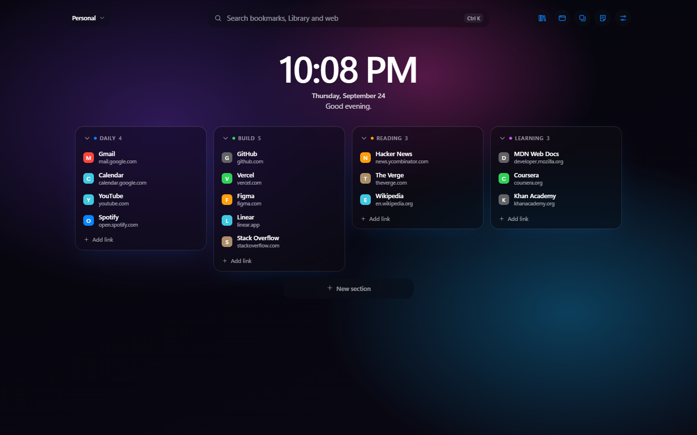
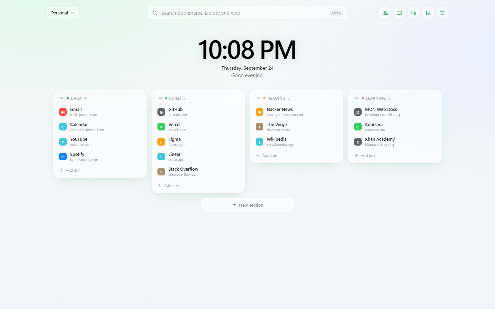
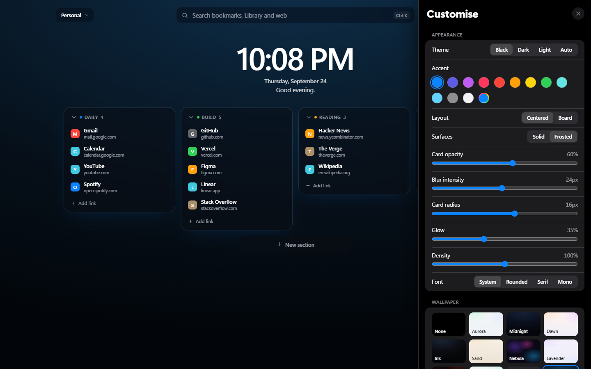

# TabOgt

A calm, fast bookmark dashboard for every new tab in **Brave**, **Chrome**, **Edge** and other Chromium browsers, and in **Firefox**.
Workspaces, sections, a searchable Library for all your imported bookmarks, drag and drop everywhere,
frosted wallpapers, and free sync between laptops through your own private GitHub repository.

No accounts, no tracking, no build step: plain JavaScript that runs straight from this folder.



| Light theme | Customise |
|---|---|
|  |  |

---

## Contents

- [Features](#features)
- [Install](#install)
- [Update](#update)
- [Set up on another laptop and sync](#set-up-on-another-laptop-and-sync)
- [Import your bookmarks](#import-your-bookmarks)
- [Keyboard shortcuts](#keyboard-shortcuts)
- [Development](#development)
- [Troubleshooting](#troubleshooting)
- [Privacy](#privacy)
- [License](#license)

---

## Features

- **Two layouts:** *Centered*, a clock with frosted list cards (the default), or *Board*, a wide grid of icon tiles.
- **Workspaces and sections:** drag to reorder links, sections and workspaces; right-click anything for more options.
- **Library:** imports go into one searchable list instead of cluttering the page. **Organize** sorts it into a workspace by topic (Dev, Design, Video, News and more).
- **Search (Ctrl K):** covers bookmarks, the Library, commands (type `>`) and the web. Drag any result onto the board.
- **Import:** Brave/Chrome bookmarks, browser HTML exports, Raindrop, Pocket, any CSV with a link column, or a plain `.txt` list of links.
- **Themes:** Black (OLED), Dark and Light, with iOS system accent colours. Text on buttons stays readable with any accent.
- **Wallpapers:** 13 gradients, or your own photo (upload or paste a link), with frosted cards you can tune: opacity, blur, radius, spacing, density and glow.
- **Sessions:** save every tab in a window and bring them back later.
- **Notes:** each workspace has its own notes, saved automatically.
- **Toolbar popup:** save the page you're on (Alt+Shift+D), or save instantly to your last section (Alt+Shift+S).
- **Sync:** optional, free, through a private GitHub repository you own. Edits made on two laptops are merged, not overwritten.

## Install

TabOgt comes in two editions built from the same code. Download the one for your browser from the
**[Releases page](https://github.com/xdrk14/TabOGT/releases/latest)**:

| Your browser | Download | Install method |
|---|---|---|
| **Brave, Chrome, Edge, Vivaldi, Opera** (Chromium, version 111+) | `TabOgt-chromium-v<version>.zip` | Unzip, then **Load unpacked** |
| **Firefox** (version 128+) | Firefox Add-ons *(coming soon)*, or `TabOgt-firefox-v<version>.zip` to try it now | **Add to Firefox**, or a temporary install |

The two files never overlap: the Chromium zip unzips into its own `TabOgt-chromium` folder, and the Firefox file is
only used by Firefox. You can have TabOgt in Brave and in Firefox on the same computer; each browser keeps its own
bookmarks unless you turn on [sync](#set-up-on-another-laptop-and-sync).

### Brave, Chrome, Edge and other Chromium browsers

1. Download **`TabOgt-chromium-v<version>.zip`** from the [latest release](https://github.com/xdrk14/TabOGT/releases/latest).
2. Unzip it: right-click > **Extract All**. You get a folder called **`TabOgt-chromium`**.
3. Move that folder somewhere permanent, for example `Documents\TabOgt-chromium`.
   The browser loads TabOgt from this folder, so don't delete or move it afterwards.
4. Open the extensions page:
   - Brave: `brave://extensions`
   - Chrome: `chrome://extensions`
   - Edge: `edge://extensions`
5. Turn on **Developer mode** (a switch in the top-right corner, or the left sidebar in Edge).
6. Click **Load unpacked** and select the **`TabOgt-chromium`** folder (the one that contains `manifest.json`).
7. Open a new tab. If the browser asks whether to keep the new-tab change, choose **Keep it**.
8. Click the puzzle icon in the toolbar and **pin TabOgt** so the save popup is one click away.

### Firefox

**From Firefox Add-ons (recommended, once listed):** open TabOgt's page on addons.mozilla.org and click
**Add to Firefox**. Firefox then keeps it updated automatically. The listing is being prepared; the link will
appear here when it is live.

**Until then, install it yourself** (Firefox's version of Chrome's *Load unpacked*). Pick the option that fits your Firefox:

| Your Firefox | Stays installed after a restart? | Method |
|---|---|---|
| Regular Firefox | No, it is removed when Firefox closes | [A. Temporary add-on](#a-temporary-add-on-any-firefox) |
| Firefox **Developer Edition**, **Nightly** or **ESR** | Yes | [B. Permanent self-install](#b-permanent-self-install-developer-edition-nightly-or-esr) |

Regular Firefox only keeps add-ons that Mozilla has signed. That is what the Add-ons listing provides, so
option B needs one of the Firefox versions that let you switch the signature check off.

#### A. Temporary add-on (any Firefox)

1. Download **`TabOgt-firefox-v<version>.zip`** from the [latest release](https://github.com/xdrk14/TabOGT/releases/latest).
2. In Firefox, go to `about:debugging#/runtime/this-firefox`.
3. Click **Load Temporary Add-on…** and pick the downloaded zip. You can also unzip it and pick its `manifest.json`.
4. Open a new tab. Firefox may ask whether to keep the new-tab change; choose **Keep changes**.

It is removed when Firefox restarts, and your TabOgt bookmarks go with it. Before closing Firefox, back up
(**Customise > Back up (JSON)**) or use [sync](#set-up-on-another-laptop-and-sync). After the next start, load it again
and restore.

#### B. Permanent self-install (Developer Edition, Nightly or ESR)

This keeps TabOgt installed across restarts, like *Load unpacked* in Chrome.

1. Get [Firefox Developer Edition](https://www.mozilla.org/firefox/developer/), [Nightly](https://www.mozilla.org/firefox/channel/desktop/#nightly)
   or [ESR](https://www.mozilla.org/firefox/enterprise/) if you don't have one.
2. Allow unsigned add-ons in that Firefox:
   1. Go to `about:config` and accept the warning.
   2. Search for `xpinstall.signatures.required` and set it to **false** (click the toggle).
3. Download **`TabOgt-firefox-v<version>.zip`** from the [latest release](https://github.com/xdrk14/TabOGT/releases/latest)
   and rename it from **`.zip` to `.xpi`**, for example `TabOgt-firefox-v1.5.0.xpi`. An `.xpi` is just a zip with a
   different name. If Windows hides file extensions: File Explorer > **View > Show > File name extensions**.
4. Go to `about:addons`, click the **gear icon > Install Add-on From File…**, and pick the `.xpi`. Confirm with **Add**.
5. Open a new tab and choose **Keep changes** if Firefox asks.

**To update:** download the new zip, rename it to `.xpi`, and install it the same way (step 4). It replaces the old
version and keeps your bookmarks.

The signature switch only affects that Firefox profile. Only install add-ons you trust while it is off.

**Firefox differences:**

- Site icons show as coloured letters by default: Firefox gives extensions no private icon source.
  Choose **Customise > Behaviour > Site icons > Sharper** for real icons from Google's icon service.

### From source (developers)

The repository root *is* the Chromium edition, and `firefox/` is the Firefox edition:

```bash
git clone https://github.com/xdrk14/TabOGT.git
```

- **Chromium browsers:** **Load unpacked** the cloned `TabOGT` folder.
- **Firefox:** use **Load Temporary Add-on** and pick `firefox/manifest.json`.

## Update

**Brave, Chrome, Edge:**

1. Download the new `TabOgt-chromium` zip.
2. Unzip it, then copy its files **over the same `TabOgt-chromium` folder** you installed from.
3. Click the **reload** arrow on the TabOgt card at `brave://extensions`.

**Firefox:**

- Installed from Firefox Add-ons: updates arrive automatically.
- Temporary install: load the new zip the same way.

**From source:** run `git pull`, then reload.

> Always update the files **in the same folder**. Loading TabOgt from a different folder makes a Chromium browser
> treat it as a new extension with empty data. If that happens, use the steps in [Troubleshooting](#troubleshooting).

## Set up on another laptop and sync

Install TabOgt on each laptop as above, then connect both to the same **private** GitHub repository.
This is free and takes about 3 minutes the first time.

**1. Create a private repository for your data** (separate from this code repository):

1. Go to [github.com/new](https://github.com/new).
2. Name it, for example `tabogt-data`.
3. Choose **Private**.
4. Click **Create repository**.

**2. Create an access token:**

1. On GitHub, go to **Settings > Developer settings > Personal access tokens > Fine-grained tokens > Generate new token**.
2. **Repository access:** *Only select repositories* > `tabogt-data`.
3. **Permissions > Repository permissions > Contents:** *Read and write*.
4. Click **Generate** and copy the token. It starts with `github_pat_`.

**3. Connect TabOgt:**

1. Open a new tab and go to **Customise (sliders icon) > Sync**.
2. Enter `yourname/tabogt-data` and paste the token.
3. Click **Connect**.

**4. On the next laptop:** do step 3 again and choose **Use GitHub data**.

**How it works after that:**

- Changes upload a few seconds after you make them.
- Other laptops pick them up when you open a new tab, and every 5 minutes.
- If you edit on two laptops before they sync, both sets of changes are kept.
- The token is stored only in that browser. It is not in backups or in the synced file.
- When the token expires, make a new one and click **Connect** again.

## Import your bookmarks

Open the **Library** (first toolbar icon), then choose one of:

- **Import from Brave:** copies your browser bookmarks, keeping their folders.
- **Import file:** accepts
  - browser bookmark exports (`.html`)
  - Raindrop exports (HTML or CSV)
  - Pocket and any other CSV or TSV with a link column
  - a `.txt` list of links
  - a TabOgt backup (`.json`)

Imports land in the Library as one list (duplicates are skipped) and are searchable with **Ctrl K**.
To put them on the board:

- click **Organize into a workspace** to have them sorted by topic, or
- drag a Library folder or a search result onto the board, or
- press **+** / **Alt+Enter** on a search result.

## Keyboard shortcuts

| Keys | Action |
|---|---|
| **Ctrl K** or **/** | Search and commands (type `>` for commands) |
| Just start typing | Search |
| **Alt Enter** | Add a Library search result to the board |
| **Ctrl V** | Paste a link into the section under the mouse |
| **Alt 1** to **Alt 9** | Switch workspace |
| **Ctrl Z** | Undo the last change |
| **E** or **F2** | Edit the focused bookmark |
| **Delete** | Delete the focused bookmark |
| **Esc** | Close panels, menus and dialogs |
| **Alt Shift D** | Open the save popup (on any page) |
| **Alt Shift S** | Save the current page instantly (on any page) |

Change the Alt+Shift shortcuts at `brave://extensions/shortcuts`.

---

## Development

TabOgt is a Manifest V3 extension written in plain ES-module JavaScript: no framework, no bundler, no build step.
Edit a file, click **reload** on the extension card, and open a new tab.

### Project layout

| Path | What it is |
|---|---|
| `manifest.json` | Extension manifest: permissions, new-tab override, popup, shortcuts |
| `newtab.html` / `newtab.css` / `newtab.js` | The dashboard |
| `popup.html` / `popup.css` / `popup.js` | The toolbar "Save to TabOgt" popup |
| `background.js` | Service worker: right-click menus, Alt+Shift+S quick-save, sync scheduling |
| `store.js` | Shared data layer (`chrome.storage.local`), data validation and migrations, colour contrast helpers |
| `sync.js` | GitHub sync: three-way merge plus the GitHub Contents API |
| `organize.js` | Sorts Library bookmarks into topic sections |
| `boot.js` | Applies the saved theme before the page paints (no flash) |
| `icons/` | Extension icons; `icon.svg` and `icon-small.svg` are the sources |
| `firefox/` | The Firefox edition, generated by `npm run build` (don't edit by hand) |
| `scripts/build.mjs` | Builds `firefox/` and the release zips in `dist/` |
| `.github/workflows/release.yml` | Publishes a GitHub release when a `v*` tag is pushed |
| `package.json` | `npm run build`, `lint:firefox`, `test`, `test:firefox` |
| `tests/` | Playwright end-to-end tests (Chromium), the Firefox smoke test, and tooling (not part of the extension) |
| `docs/` | README screenshots |
| `CHANGELOG.md` | What changed in each version, and why |

### Requirements

- **Node.js 18 or newer:** download from [nodejs.org](https://nodejs.org), then check with `node -v`.
- **A Chromium browser:** the tests use your installed **Brave** by default.

### Install the test tools

```bash
cd tests
npm install
```

The tests use your installed Brave (`%LOCALAPPDATA%\BraveSoftware\Brave-Browser\Application\brave.exe`).
If you don't have Brave, either point them at another Chromium browser (see below), or download
Playwright's own Chromium:

```bash
npx playwright install chromium
```

### Run the tests

Run everything (about 2 minutes). It opens a throwaway browser profile, never your real one:

```bash
npm test
```

Run only the tests whose name matches some text:

```bash
npm run test:one -- "search"
```

Options, set as environment variables before `npm test`:

| Variable | Effect |
|---|---|
| `HEADED=1` | Show the browser window while testing |
| `GPU=1` | Use the graphics card (closer to real performance numbers) |
| `TABOGT_BROWSER=<path>` | Use a different browser executable (Chrome, Edge, Chromium) |

Setting a variable, for example `HEADED`:

- **PowerShell:** `$env:HEADED=1; npm test`
- **Command Prompt:** `set HEADED=1 && npm test`
- **macOS/Linux:** `HEADED=1 npm test`

Screenshots and a performance report (`perf.json`) are written to `tests/screenshots/`.

### Other scripts

Re-render the README screenshots in `docs/`:

```bash
npm run docs
```

Rebuild `icons/*.png` from `icons/icon.svg` and `icons/icon-small.svg`:

```bash
npm run icons
```

### Build the release files

From the repository root:

```bash
npm run build
```

This makes:

- `firefox/`: the Firefox edition. It is the same code with a Firefox-only `manifest.json`: background scripts
  instead of a service worker, no `favicon` permission, the add-on ID `tabogt@xdrk14`, Firefox 128+, and a
  "no data collected" declaration. It is regenerated on every build, so **edit the root files, never `firefox/`**,
  and commit the rebuilt folder.
- `dist/TabOgt-chromium-v<version>.zip`: for Brave, Chrome and Edge.
- `dist/TabOgt-firefox-v<version>.zip`: for Firefox and addons.mozilla.org. `manifest.json` sits at the zip root, as AMO requires.

Check the Firefox edition with Mozilla's own validator (the same checks AMO runs):

```bash
npm run lint:firefox
```

Run the Firefox smoke test in your installed Firefox. It uses a throwaway profile and a temporary add-on:

```bash
npm run test:firefox
```

### Publish a release

1. Bump `"version"` in `manifest.json` and add a section for it to `CHANGELOG.md`.
2. Rebuild and commit:

   ```bash
   npm run build
   git add -A
   git commit -m "TabOgt 1.x.y"
   git push
   ```

3. Tag the version and push the tag. GitHub Actions (`.github/workflows/release.yml`) then builds both zips, runs
   Mozilla's validator, and publishes the release with both files attached:

   ```bash
   git tag v1.x.y
   git push origin v1.x.y
   ```

### Publish to Firefox Add-ons (addons.mozilla.org)

1. Sign in at [addons.mozilla.org/developers](https://addons.mozilla.org/developers/).
2. **First version:** choose **Submit a New Add-on** > **On this site**, then upload `TabOgt-firefox-v<version>.zip`.
   - When asked about source code, answer **No**: the code is plain and unminified.
   - Fill in the listing: name, summary, category, screenshots from `docs/`, and a privacy note that TabOgt collects no data.
3. **Each later version:** go to the add-on's page > **Upload New Version** and upload that version's zip.
4. Mozilla reviews listed add-ons, usually within a few days. Every new version is signed again automatically
   when it is approved, and Firefox users get it as an automatic update.

---

## Troubleshooting

**Every new tab looks empty after an update.**
The browser identifies an unpacked extension by its folder. If TabOgt was loaded from a new folder,
it starts with empty data. To get your bookmarks back:

1. In the old copy (or any laptop where your data is), use **Customise > Back up (JSON)**.
2. In the new copy, use **Customise > Import file**.

With sync connected, just connect again and choose **Use GitHub data**.

**"Could not load manifest" or files are missing (OneDrive or Google Drive folder).**
Make sure the folder is available offline: right-click it and choose **Always keep on this device** or **Available offline**.

**The new tab still shows the browser's own page.**
Check that TabOgt is enabled at `brave://extensions`. If another extension also replaces the new tab, disable it.

**Firefox: TabOgt disappeared after restarting Firefox.**
Temporary add-ons (loaded from `about:debugging`) are removed when Firefox closes. Install it from Firefox Add-ons
once it is listed, or load it again and restore your backup or sync.

**Sync says the token was rejected.**
The token expired or lost access. Create a new one (see [Sync](#set-up-on-another-laptop-and-sync)) and click **Connect** again.

**Site icons look wrong or are missing.**
Use **Customise > Behaviour > Refresh icons**. Private mode only shows icons for sites you have visited in this browser;
choose **Sharper** to fetch them from Google's icon service instead.

## Privacy

- Everything is stored locally in your browser.
- Site icons come from the browser itself, unless you choose **Sharper**.
- Nothing is sent anywhere, except to *your own* GitHub repository if you turn sync on.
- There are no analytics and no accounts.

## License

[GPL-3.0](LICENSE)
